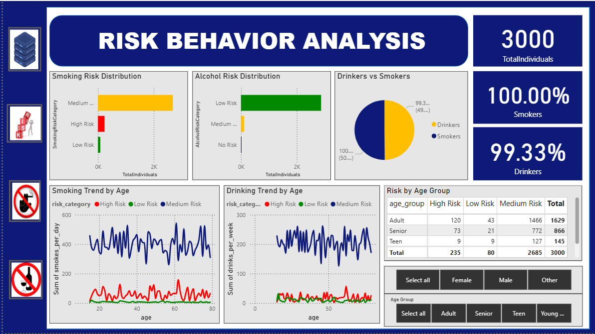

# 📊 Risk Behavior Analysis & Prediction

🚀 An end-to-end Data Science project that analyzes demographic and lifestyle data to predict **smoking and alcohol risk behavior**, and visualizes insights using interactive **Power BI dashboards**.

---

## 🔥 Project Overview

* Analysed **3000+ individuals** using demographic and lifestyle features
* Predicted **risk levels (High, Medium, Low)** for smoking and alcohol behavior
* Identified key drivers such as **age, mental health, diet, and exercise**
* Built interactive dashboards for **data-driven decision making**

---

## 🛠️ Tech Stack

* **Python** (Pandas, NumPy, Matplotlib, Seaborn)
* **Machine Learning** (Scikit-learn)
* **Power BI** (Dashboard & Visualization)
* **Jupyter Notebook**

---

## ⚙️ Workflow

```text
Data Collection (CSV)
        ↓
Data Cleaning & Preprocessing
        ↓
Exploratory Data Analysis (EDA)
        ↓
Machine Learning Models
        ↓
Prediction Results
        ↓
Power BI Dashboard
```

---

## 🤖 Machine Learning

* Implemented:

  * Logistic Regression (**~96.0% accuracy**)
  * Decision Tree (**~90.3% accuracy**)
  * Random Forest (**~96.0% accuracy**)
* Classified individuals into **risk categories**
* Evaluated using:

  * Accuracy
  * Precision, Recall, F1-score

---

## 📊 Key Insights

* 📌 **Age 20–40** shows highest risk behavior
* 📌 **Poor mental health** strongly linked to smoking & drinking
* 📌 **Low exercise & unhealthy diet** increase risk levels
* 📌 Majority fall under **medium smoking risk & low alcohol risk**

---

## 📸 Dashboard Preview



---

## 📈 Features

* Interactive filters (Age, Gender)
* Smoking & Alcohol Risk Distribution
* Drinking vs Smoking Comparison
* Risk Trends by Age
* Demographic-based analysis

---

## 📂 Project Structure

```bash
├── Dashboard.pbix
├── EDA.ipynb
├── ML_Model.ipynb
├── dataset.csv
├── Report.pdf
├── Presentation.pptx
├── README.md
└── assets/
    └── dashboard.png
```

---

## 🎯 Outcome

* Built a complete **data → ML → visualization pipeline**
* Generated actionable insights for **health risk analysis**
* Demonstrated **data storytelling using Power BI**

---

## 🔗 Connect With Me

* 💼 [LinkedIn](https://www.linkedin.com/in/aditya-kumar-singh-990377291/)
* 📁 [Portfolio](https://adityasingh81201.wixsite.com/professional-portfol)
* 📧 [Email](mailto:adityasingh81201@gmail.com)

---

⭐ If you found this project useful, consider giving it a star!
